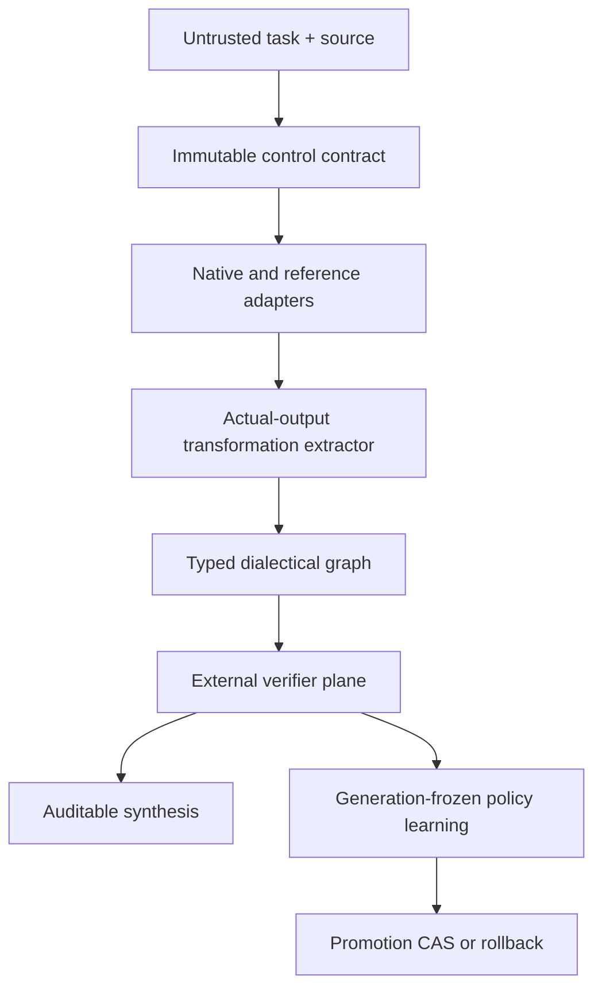
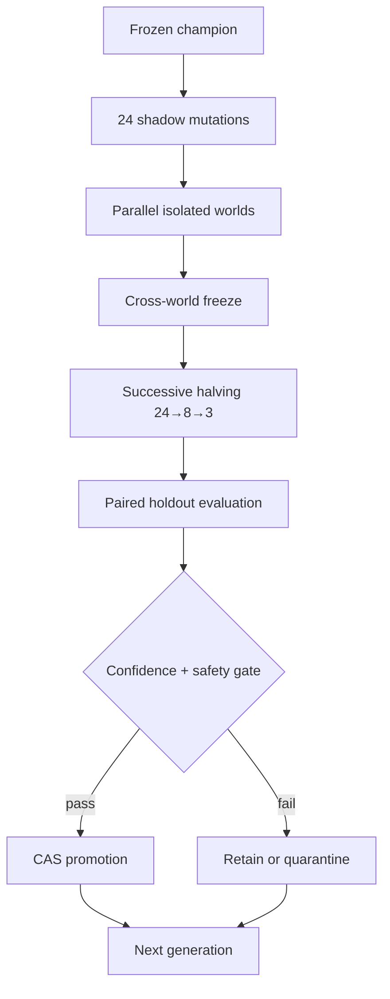

# MetaEngine 16X 2.3 — outcome-gated architecture

MetaEngine 2.3 is an auditable orchestration and controlled policy-learning system. It is not a foundation model and does not claim parity with frontier agents unless the same externally evaluated benchmark is actually run against them.

## Execution and learning boundary



An ordinary run without an oracle can validate integrity, source spans, handoff enforcement and safety. It emits `INSUFFICIENT_EXTERNAL_EVIDENCE`; it cannot update biographies or promote a policy. Outcome learning occurs only inside an explicitly versioned benchmark campaign.

## Honest executor disclosure

- Engines 01–04: local native executors.
- Engines 05–16: clean-room reference simulations of architectural patterns.
- Reference simulations return `REFERENCE_SIMULATION_COMPLETE` or `DEEP_REFERENCE_SIMULATION`; they are never counted as real frontier executors.
- There is no silent fallback from a real adapter to a simulation.

The complete declaration is in `config/adapter_registry_2_3.json`. MetaEngine is not eligible for a frontier-parity claim until at least three genuinely independent model/tool stacks pass the same sealed holdout under equal budgets.

## Typed handoff and security boundary

Every deep execution receives a separate hash-verified handoff containing objective, workstream, budget, input references and immutable guardrails. The handoff is placed before the untrusted source and is not appended to a truncatable pressure list. Missing or modified handoffs fail closed.

Executable lineage files are checked against `SHA256SUMS.txt` before Python import or Node launch. Native processes run in a separate process group and the whole group is killed on timeout. Cache payloads have their own integrity hash. Source text can be classified as adversarial content but never gains policy or tool authority.

This boundary is stronger than a prompt-level instruction, but it is not a complete kernel/network sandbox. Real external tool adapters remain an installation gate.

## Actual-output transformations

Version 2.2 generated transformations from a static engine-to-type map. Version 2.3 removes that path. A transformation is admitted only when an operator pattern is found in actual canonical/native output. Each record contains output provenance and, when resolvable, an exact source span. Empty output produces no transformation.

Structural novelty remains diagnostic. It cannot become an observed outcome.

## Typed dialectical graph

The active policy can combine ten bounded operators:

1. `SOURCE_READING`
2. `HORIZON_DISCLOSURE`
3. `RIVAL_FORK`
4. `SEMANTIC_COUNTERFACTUAL`
5. `GENEALOGICAL_RETURN`
6. `EVIDENCE_DISCRIMINATOR`
7. `DOUBLE_HERMENEUTIC`
8. `SUBLATION_WITH_RESIDUE`
9. `OPERATOR_MUTATION`
10. `SOURCE_RETURN`

Nodes preserve assumptions, exact spans where required, rival identities, falsifiers, residual tensions, calibrated confidence placeholders and abstention reasons. Every node and edge has `truth_effect: NONE`. Nonlinearity means returning through rival interpretations, changed operators and source checks—not merely increasing graph size.

## Controlled self-learning

Only a declarative `ArchitecturePolicy` can self-update. The mutable surface is limited to topology, waves, dialectic operators, bounded compute and exploration rate. Code, evaluator, oracle, guardrails, source firewall, truth policy, promotion gate and tool permissions are immutable to the evolutionary loop.



Updating after an individual world is forbidden. Sibling worlds share one frozen champion and cannot observe one another before the barrier. The gate uses paired deltas, a multiplicity-corrected bootstrap lower bound, suite non-inferiority, zero hard safety failures and a bounded cost ratio. The prior champion remains a rollback target.

## Verifier plane

The built-in verifier checks:

- exact source-span bounds and hashes;
- actual-output rather than static-map provenance;
- required dialectical operations in deterministic WorldBench tasks;
- preservation of rivals and residual tensions;
- source return and abstention behavior;
- forbidden/injected content;
- measured wall time and graph cost.

Without a sealed oracle, `observed_outcome` is `null`. Structural proxies, ensemble scores, causal depth and topology diversity are excluded from promotion.

The built-in WorldBench is a local deterministic capability harness. It validates the learning mechanism; it is not an independent expert benchmark and cannot establish parity with GPT-5.6, Claude Research, Magentic-One, AI Co-Scientist or AlphaEvolve.

## Persistence

Local JSON/JSONL remains the portable audit record. Supabase project `gzrbxoiuenkksualgpvp` is the sole canonical cloud ledger and promotion authority. Replication stages a content-addressed outbox before every cloud write, keeps credentials out of the `psql` argument list and supports retries. `storage/outcome_gated_self_learning_2_3.sql` defines policy, generation, external outcome, promotion, champion, rollback, dialectical graph, verifier and telemetry ledgers with fail-closed RLS.

The 2.2 and 2.3 migrations are applied to Supabase. All 14 new tables have forced RLS and explicit writer policies; promotion is generation-frozen, compare-and-swap guarded and search-path hardened. Neon is retired with no reads or writes and was not physically deleted. Cloud persistence cannot override evidence rules or become an epistemic authority independently of verified outcomes.

## CLI

```bash
destruktion-meta16 run examples/sample_input.md --out run_23 --max-workers 8
destruktion-meta16 active-policy
destruktion-meta16 evolve --out evolution_23 --generations 3 --candidates 24 --world-workers 8 --seeds 17 43 --cases-per-suite 8
destruktion-meta16 rollback-policy POLICY_HASH --reason "canary regression"
```

## Remaining frontier gate

To measure world-class task ability rather than architecture correctness, install real browser/retrieval/code/model adapters; run MetaEngine and single-agent/best-of-N/simple-orchestrator baselines on the same blinded tasks with equal token, time and dollar budgets; add independent citation entailment and human hermeneutic review; then require reproducible positive lower confidence bounds on untouched holdout data.
