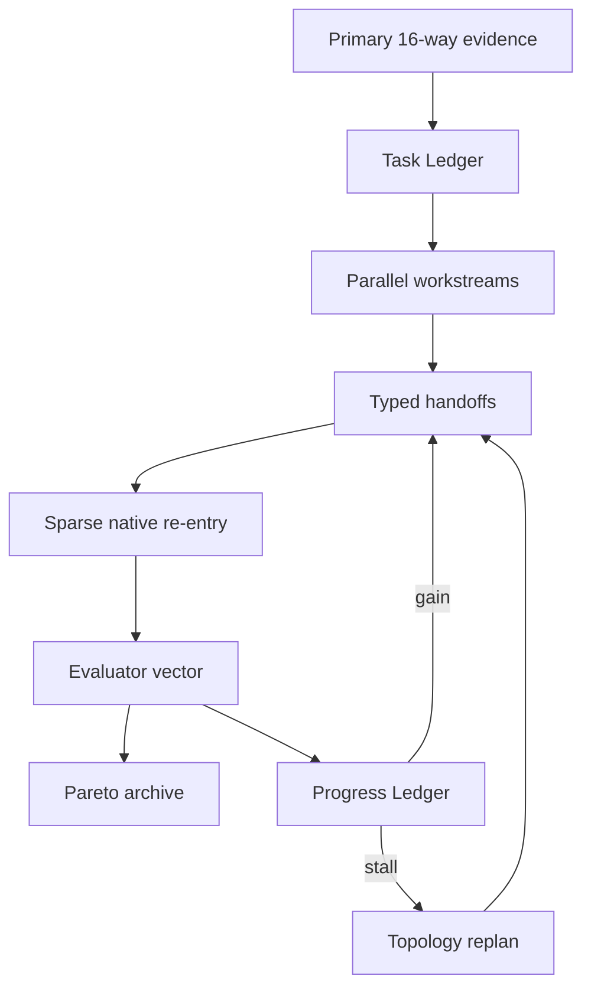

# Интеграция мировых frontier-архитектур в MetaEngine 16X 2.2

## Принцип отбора

«Самая сильная модель» быстро меняется и плохо определяется одной benchmark-цифрой. Поэтому отбор сделан по четырём признакам: публично раскрытая архитектура, подтверждённая работа на сложных long-horizon задачах, переносимость паттерна без копирования закрытых весов и совместимость с provenance-инвариантами MetaEngine.

В 2.2 интегрированы не бренды и не закрытые prompts, а проверяемые архитектурные механизмы.

## Сравнение и перенос

| Система | Сильный паттерн | Что уже было в 2.1 | Что добавлено в 2.2 | Ограничение |
|---|---|---|---|---|
| Anthropic Research | Lead agent + параллельные специализированные workers; breadth-first поиск | Параллельная primary wave и experimental worlds | Domain workstreams и breadth-first ownership до глубины | Применять только когда подзадачи действительно независимы |
| Microsoft Magentic-One | Task Ledger, Progress Ledger, stall detection, replan | Scheduler rounds и depth stop | Разделение facts/assumptions/unknowns; явный progress ledger; replan меняет topology | Replan не меняет truth status |
| Google AI Co-Scientist | Generation, Reflection, Ranking, Evolution, Proximity, Meta-review; tournaments | Coalitions, review, arbitration | Role-separated evaluator ensemble и pairwise tournament signal | Elo proxy не считается ground truth |
| Google DeepMind AlphaEvolve | Ширина/глубина генерации, automated evaluators, evolutionary archive | Generated topology candidates и biographies | Pareto candidate archive и evaluator-vector вместо одного winner score | Автооценка пригодна только для измеримых свойств |
| DSPy GEPA | Рефлексия над execution traces и Pareto-эволюция policy | Expected-gain scheduler и transformation history | Trace-derived policy candidates | Только `SHADOW_ONLY` до внешнего benchmark |
| OpenAI Agents SDK | Handoffs, guardrails, tracing | Re-entry receipts и local ledger | Typed handoff contract с hash inputs, budget и guardrails | Handoff не наследует эпистемическую авторитетность |
| OpenAI Deep Research | Многошаговый поиск, адаптация к найденному, синтез с источниками | Отдельный Engine 09 | Включён в evidence workstream и общий grounding contract | Архитектура закрыта частично; не имитируется сверх опубликованного |

Первичные источники:

- [Anthropic: multi-agent research system](https://www.anthropic.com/engineering/multi-agent-research-system)
- [Microsoft Research: Magentic-One](https://www.microsoft.com/en-us/research/articles/magentic-one-a-generalist-multi-agent-system-for-solving-complex-tasks/)
- [Google Research: AI Co-Scientist](https://research.google/blog/accelerating-scientific-breakthroughs-with-an-ai-co-scientist/)
- [Google DeepMind: AlphaEvolve](https://deepmind.google/blog/alphaevolve-a-gemini-powered-coding-agent-for-designing-advanced-algorithms/)
- [DSPy: GEPA](https://dspy.ai/api/optimizers/GEPA/overview/)
- [OpenAI Agents SDK](https://openai.github.io/openai-agents-python/)
- [OpenAI Deep Research](https://openai.com/index/introducing-deep-research/)

## Почему это сильнее простого добавления ещё одного engine

Engine 5–16 уже представляют значительную часть современных agent families. Проблема 2.1 была не в отсутствии ещё одной способности, а в отсутствии общего протокола, который:

1. отделяет плановые предположения от фактов;
2. выдаёт каждому specialist точный проверяемый handoff;
3. не сводит многоосевую полезность к единственному scalar winner;
4. распознаёт stall и меняет план;
5. превращает неудачные traces в проверяемые policy candidates;
6. запрещает этим candidates самовнедряться.

Именно этот слой реализован в `metaengine/frontier_control_plane.py`.

## Новый execution contract

### Task Ledger

Создаётся после primary claim/disagreement state и содержит:

- факты с artifact provenance;
- предположения с явным статусом;
- неизвестные и их evidence gate;
- независимые domain workstreams;
- определение завершённости.

### Typed Handoff

Каждый deep execution получает:

- `original_source_hash`;
- `task_ledger_hash`;
- `scheduler_plan_hash`;
- `architecture_hash`;
- objective и workstream;
- cost budget;
- обязательный output: typed transformation или abstention;
- пять guardrails.

Handoff hash включается в pressure context и, следовательно, в exact cache key. Результат другого задания больше не может быть случайно переиспользован только из-за совпадения engine/topology.

### Evaluator Ensemble

Кандидаты оцениваются по независимым осям:

- наличие source-regrounding contract;
- новизна типа трансформации;
- независимый challenge;
- gain/cost;
- execution integrity;
- abstention safety.

Оценка — сигнал для управления вычислением, не оценка истины. Поэтому candidate имеет `truth_effect = NONE`, а tournament row — `epistemic_authority = false`.

### Pareto archive

Вместо удаления всех кандидатов кроме одного сохраняются недоминируемые альтернативы. Это особенно важно для MetaEngine: семантическая точность, новизна, независимость и стоимость не сводятся честно к одному числу.

### Trace-driven evolution

При повторе topology с низким gain, отсутствии новых transformation types или явном marginal/echo stop система создаёт policy candidate:

- `TOPOLOGY_DIVERSITY_FLOOR`;
- `ROUTER_HIGH_RESOLUTION_TASK_STATE`;
- `BREADTH_FIRST_WORKSTREAM_REDECOMPOSITION`.

Кандидат имеет `deployment_status = SHADOW_ONLY`, `self_deployment_allowed = false` и внешний acceptance gate. Это переносит идею reflective evolution, не создавая неконтролируемое самоизменение production policy.

## Изменения в коде

| Область | Изменение |
|---|---|
| `frontier_control_plane.py` | Task/Progress Ledger, typed handoffs, ensemble, tournament, Pareto archive, shadow policy |
| `orchestrator.py` | Control plane включён в каждый run и каждый deep round |
| `architecture_evolution.py` | Progress stall может выбрать разнообразную альтернативную topology |
| `replication.py` | Новые ledger-артефакты включены в переносимый Postgres replication contract |
| `frontier_evidence_control_2_2.sql` | Пять RLS-enabled таблиц для control plane |
| `frontier_control_plane.schema.json` | Машиночитаемые safety-инварианты |
| `test_frontier_control_plane_2_2.py` | Regression tests для ledgers, handoffs, Pareto и shadow-only policy |

## Что сознательно не интегрировано

- закрытые model weights, внутренние prompts и нераскрытые training pipelines;
- self-rated Elo как доказательство истинности;
- бесконтрольное размножение агентов;
- автоматическое применение evolved policy;
- majority voting;
- изменение native lineage;
- внешние SDK как обязательные runtime dependencies.

Это сохраняет portable-режим и не превращает MetaEngine в хрупкую композицию чужих фреймворков.

## Критерий реального успеха

2.2 доказывает интеграцию архитектуры и инвариантов, но не улучшение внешнего reasoning quality. Следующий обязательный gate — пререгистрированный blind benchmark против:

- лучшего одиночного engine;
- MetaEngine 2.1;
- MetaEngine 2.2 без replanning;
- полного MetaEngine 2.2.

Сравнивать следует quality, calibration, citation correctness, unique useful contribution, latency и cost. Только такой тест может превратить архитектурную гипотезу 2.2 в доказанный прирост.
