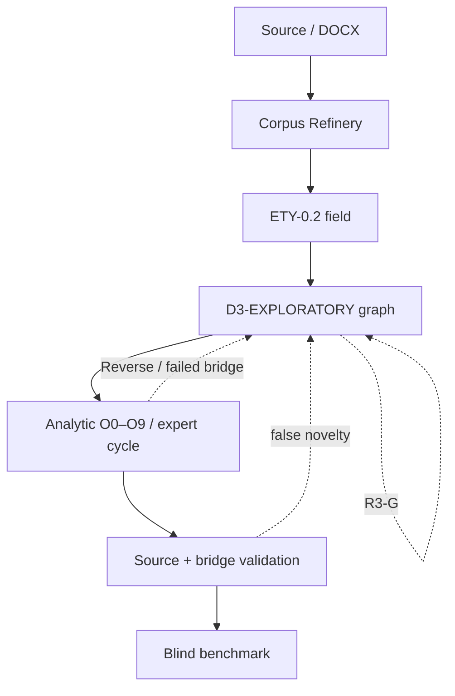

# Архитектура DAE 0.5.0

## Принцип

DAE теперь содержит два несливаемых двигателя:

- генеративный: производит трассируемые кандидаты на новые философские переходы;
- аналитико-аудиторский: проверяет право на переход и может вынести run-bound решение.

Первый не говорит `true/false`; второй не должен определять, какие неожиданные вопросы вообще достойны появления. Между ними действует firewall `discovery ≠ justification`.

## Полный контур

ETY — обязательный partial-order constraint: центральный концепт должен иметь паспорт до strong reconstruction. Это не фиксированная стадия одинаковой глубины; ETY-MIN может остаться null result, а ETY-FULL может ветвить Problemgenese.

## Эпистемические права слоёв

| Слой | Что машина вправе установить | Чего не устанавливает |
|---|---|---|
| Corpus Refinery | fixity, competing unitizations, selectors, routing candidates | авторство и смысл неразрешённых фрагментов |
| ETY-0.2 | полноту ETY-MIN/ETY-FULL, переводческие residuals и незаполненные поля | актуальный смысл из происхождения; language→ontology |
| D3-EXPLORATORY | problem forks, genealogies, residuals, polyphony, formal indications, R3-G | истину, confidence и терминальный verdict |
| Structural/policy | JSON Schema, AAG/DAG, bridge/promotion incompatibility | адекватность содержательного bridge |
| Expert cycle | A/P/B, strongest available rival, terminal run-bound adjudication | непогрешимость и внешнюю validity |
| Benchmark | fixity, blinding, agreement, metrics, frozen gates | независимые labels или переносимость за sample |
| Human/domain review | локальную содержательную оценку | универсальность за пределами корпуса |

## Живая констелляция

Вместо обязательной последовательности операций используется `REVISABLE_DIRECTED_MULTIGRAPH`. Шесть GX-жестов срабатывают независимо:

- GX1 Residual Probe;
- GX2 Countergenetic Fork;
- GX3 Reverse Arrow;
- GX4 Polyphonic Reconstruction;
- GX5 Formal-Indication Generator;
- GX6 R3 Branching.

32 предметных семейства выбираются по вопросу и tension signatures. Ветки 2.27 и 2.28 не сводятся друг к другу. Seed меняет traversal, но при полном бюджете не меняет множество кандидатов.

Каждый активный шаг должен дать минимум один качественный gain:

| Gain | Изменение |
|---|---|
| GG1 | новое различие |
| GG2 | новый вопрос |
| GG3 | новый соперник |
| GG4 | переворот направления критики |
| GG5 | новый феномен/residual |
| GG6 | продуктивная исследовательская ветвь |

Оператор без gain снимается. Слабый материал может мотивированно пропустить жест; это предпочтительнее сфабрикованной неожиданности.

## Компоненты

| Компонент | Контракт |
|---|---|
| `etymology` | mandatory ETY-MIN/FULL cards, anti-fallacy firewall, bridge prohibition |
| `living-analysis` | нелинейный GX-граф, констелляции, sufficient openness, narrative и trace |
| `engine` | TRC/module validation и semantic issue list |
| `run-validator` | 4A/4D dependency graphs |
| `protocol-runner` | evidence-bearing процедуры v3.8 |
| `corpus-refinery` | competing segmentations, source map, ledger, hypothesis bank, archive map |
| `expert-cycle` | ETY pre-pass + RECONSTRUCTOR/CRITIC/ADJUDICATOR/SYNTHESIS |
| `benchmark` | sealed predictions, blind packets, independent labels/gold, metrics |
| `ro-crate` | self-describing research package и fixity |

## Достаточная открытость

Exploratory run останавливается не при закрытии, а когда вопрос изменён, различие возникло, живой rival сохранён, reverse pressure учтён, residual типизирован и задан revision trigger. Это `SUFFICIENT_OPENNESS_NOT_CLOSURE`, а не PASS.

R3 различается как:

- R3-U — материала недостаточно;
- R3-A — апория;
- R3-R — остаток реконструкции;
- R3-G — генеративный остаток, который один вправе создать research branch.

## Frozen/public boundary

`vendor/core4` остаётся неизменяемой зависимостью. D3-EXPLORATORY и ETY-0.2 меняют execution architecture, но не добавляют O10, RT29 или скрытую relation ontology. Официальный toolkit 4D хранится byte-identical в `vendor/module4d_upstream`; строгие схемы DAE живут отдельно как compatibility profile.

## Безопасность вывода

- exploratory artifact запрещает `status`, `confidence`, `finality`, `verdict`;
- mandatory ETY не означает mandatory significance;
- local context > etymological possibility;
- provenance ≠ reconstructability;
- novelty ≠ evidence;
- G4 ≠ high confidence;
- Positive Kernel остаётся доступен Reverse Arrow и Self-Critique;
- только R3-G создаёт ветвь;
- source text не включается в derivative-only outputs;
- expert terminality остаётся run-bound;
- blind benchmark без labels/gold остаётся blocked.

## Claim ceiling

DAE 0.5.0 утверждает исполнимость обязательного этимологического покрытия, трассируемой нелинейной генерации, детерминированной проверки и run-bound экспертного цикла. Он не утверждает философскую истину сгенерированных кандидатов, внешнюю оригинальность, полноту исторической лингвистики, независимую semantic validity или превосходство над предметным экспертом.
