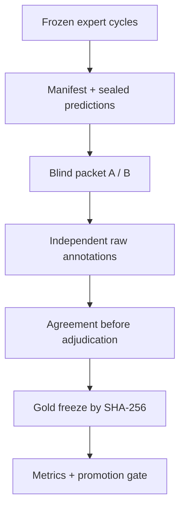

# Эмпирическая валидация автономного эксперта

## Назначение

Контур 0.4 проверяет не то, умеет ли движок завершить собственный workflow, а то, совпадают ли его терминальные решения с независимо сформированным adjudicated gold-набором. Предсказания DAE не являются разметкой, а разработчик системы не считается независимым кодировщиком.

Текущий реальный GA-пакет содержит 9 тезисов. Он пригоден для запуска разметки, но заведомо ниже замороженного promotion minimum в 80 единиц и поэтому не может подтвердить качество системы даже после получения labels.

## Разделение артефактов

| Артефакт | Кто видит до freeze | Роль |
|---|---|---|
| `benchmark_manifest.json` | координатор | замороженные единицы, кодбук и thresholds |
| `benchmark_lock.json` | координатор | SHA-256 manifest, predictions и blind packets |
| `blind_packets/coder-*.json` | один независимый кодировщик | тезисы, source hash и candidate selectors без решения DAE |
| `sealed_predictions.json` | только хранитель benchmark | DAE и два заранее выбранных fixed baselines |
| raw annotation JSON | координатор после сдачи | независимые статусы до обсуждения |
| adjudicated gold JSON | куратор | gold, связанный с raw annotations по byte SHA-256 |
| `BENCHMARK_RESULT.json` | после gold freeze | метрики и promotion gate |

Blind packet удаляет `status`, `confidence`, reconstruction, rationale и recommendation системы. Названия четырёх допустимых классов остаются частью общего кодбука. Candidate selectors служат навигацией и не считаются gold evidence; кодировщик обязан иметь разрешённый доступ к источнику и приводить собственные evidence refs.

## Workflow



Система никогда не создаёт gold из собственных статусов. Если отсутствуют две завершённые независимые разметки либо gold, `benchmark-evaluate` выпускает отчёт `BLOCKED_PENDING_INDEPENDENT_LABELS` без confusion matrix и F1.

## Команды

```bash
# Можно объединить expert cycles разных документов в один benchmark.
node ./bin/destruktion.mjs benchmark-init \
  run-a/expert_cycle.json run-b/expert_cycle.json \
  --out ./benchmark

# До завершения разметки команда создаёт честный blocked-report.
node ./bin/destruktion.mjs benchmark-evaluate ./benchmark \
  --out ./evaluation-blocked

# После независимой разметки и отдельной курации.
node ./bin/destruktion.mjs benchmark-evaluate ./benchmark \
  --annotations ./completed-annotations \
  --gold ./gold.json \
  --out ./evaluation-final
```

Кодировщики получают только один файл из `blind_packets/` и инструкцию. Файлы из `annotation_templates/` намеренно содержат `null`-поля и не проходят schema до заполнения. Gold должен перечислять точные byte SHA-256 всех raw annotation files, использованных при adjudication.

## Метрики

DAE вычисляет матрицу ошибок по четырём заранее зарегистрированным классам, per-class precision/recall/F1, accuracy, balanced accuracy, macro- и weighted-F1. Выбор этих метрик следует задаче решения, а не удобству одной цифры; confusion matrix сохраняется как первичный диагностический объект. Такой принцип согласуется с [официальным руководством scikit-learn по оценке моделей](https://scikit-learn.org/stable/modules/model_evaluation.html).

`INSUFFICIENT` трактуется как осмысленное воздержание. Поэтому отдельно выводятся coverage, abstention rate и selective accuracy. Для уверенности в выбранном решении рассчитываются binary decision Brier score, 10-bin expected calibration error и risk–coverage curve. Это не multiclass probability score: текущий expert cycle сохраняет одну confidence выбранного класса, а не полный вероятностный вектор. Общая логика проверки confidence against observed frequency соответствует [официальному руководству scikit-learn по калибровке](https://scikit-learn.org/stable/modules/calibration.html).

Опасная перепромоция регистрируется, когда:

- DAE выдаёт `SUPPORTED`, а gold имеет любой иной статус;
- DAE выдаёт `QUALIFIED`, а gold имеет `REJECTED` или `INSUFFICIENT`.

Для point estimates строится детерминированный bootstrap 95% CI. DAE сравнивается только с двумя baseline, выбранными до просмотра gold: `ALWAYS_INSUFFICIENT` и `ALWAYS_QUALIFIED`. Это слабые sanity baselines, а не замена сильному внешнему конкуренту; comparator-native запуск остаётся обязательным внешним этапом.

## Agreement и adjudication

Номинальный Krippendorff α и его bootstrap CI считаются на raw labels до adjudication. Не менее двух кодировщиков должны завершить весь набор, подтвердить независимость, blindness и доступ к источнику. Затем куратор замораживает gold, ссылаясь на raw files по SHA-256. Такое разделение независимой annotation, agreement и последующей curation соответствует [официальному руководству INCEpTION](https://inception-project.github.io/releases/36.0/docs/user-guide.html), где agreement считается на завершённых документах нескольких annotators, а расхождения разрешаются отдельной curation.

## Замороженный promotion gate

| Проверка | Порог |
|---|---:|
| Полный benchmark | ≥ 80 units |
| Gold support каждого класса | ≥ 20 |
| Krippendorff α | ≥ 0.67 |
| Нижняя граница 95% CI α | ≥ 0.50 |
| Macro-F1 DAE | ≥ 0.70 |
| Нижняя граница 95% CI macro-F1 | ≥ 0.60 |
| Δ macro-F1 над лучшим fixed baseline | ≥ 0.05 |
| Dangerous overpromotion rate | ≤ 0.05 |
| Decision ECE | ≤ 0.15 |

Исходы:

- `INVALID_BENCHMARK` — нарушена схема, fixity либо принадлежность labels;
- `BLOCKED_PENDING_INDEPENDENT_LABELS` — labels/gold отсутствуют;
- `BLOCKED_UNDERPOWERED` — метрики доступны, но размер или class support ниже frozen minimum;
- `FAIL_RELIABILITY` — raw agreement не прошёл порог;
- `FAIL_PROMOTION_GATE` — надёжная и достаточная выборка выявила провал качества/безопасности/калибровки;
- `PASS_PROMOTION_GATE` — выполнены все замороженные условия только для данного sample.

Даже `PASS_PROMOTION_GATE` не доказывает непогрешимость, универсальную философскую истинность или переносимость на иные эпохи, языки и жанры.

## Текущее состояние GA

`experiments/heidegger-ga/user-dossier-ga1-1-2026/benchmark-0.4` содержит первый frozen benchmark: 9 units, два blind packets, sealed predictions, templates и blocked evaluation. Его корректный итог — `BLOCKED_PENDING_INDEPENDENT_LABELS`; дополнительно он отмечен `UNDERPOWERED` относительно minimum 80. Положительный 80-unit сценарий существует только как сбалансированный synthetic regression test полного вычислительного тракта и не засчитывается как empirical evidence.
