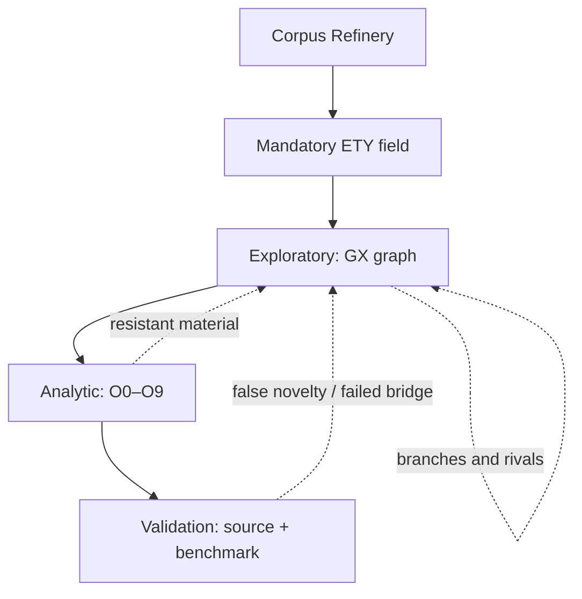

# D3-EXPLORATORY-0.2: контракт живого анализа

## Назначение

D3-EXPLORATORY — экспериментальная генеративная надстройка над неизменённым CORE 4.0 и аналитическими O0–O9. Она не выдаёт `true/false`, `PASS/FAIL` или терминальный экспертный статус. Её результат — трассируемая констелляция философских кандидатов, сопротивлений и исследовательских ветвей.

Главное правило развития:

> каждый активный шаг обязан изменить пространство вопроса и добавить хотя бы один GG1–GG7; иначе шаг снимается как ритуальный.

Это правило не требует новизны любой ценой. Допустимый gain должен быть связан с исходной апорией, иметь источник возникновения и условие пересмотра.

## Три режима полного цикла



- Exploratory производит кандидаты, различия, countergeneses и R3-G.
- Analytic проверяет relation, bridge, scope, rivals и evidence burden.
- Validation проверяет воспроизводимость, source resolution и добавочную ценность.

Ни один режим не подменяет другой. В частности, G4 означает продуктивную исследовательскую ветвь, а не сильную доказанность.

ETY-0.2 обязателен как покрытие центральных понятий, но не как источник обязательной глубины. Он может изменить Problemgenese или породить counter-etymology; если различающего материала нет, карточка остаётся честным филологическим null result.

## Нелинейность

Движок строит `REVISABLE_DIRECTED_MULTIGRAPH`. Операторы выбираются по triggers и residuals, а не по номеру стадии. Seed изменяет порядок обхода одновременно доступных операций, но при полном бюджете не меняет множество содержательных кандидатов. Это даёт вариативность маршрута без рандомизации философского вывода.

Узлы могут:

- генеалогически преобразовывать вопрос;
- спорить с другим узлом;
- деконфлировать или регионализировать;
- образовывать polyphonic field;
- критиковать Positive Kernel;
- мутировать реконструкцию;
- пересекать разные тематические констелляции;
- открывать R3-G research branch.

## Двойной регистр

| Ось | Значения | Что означает |
|---|---|---|
| Epistemic register | textual pointer, historical lead, inference, hypothesis, reconstructive proposal, open question | тип основания или утверждения |
| Generative register | G0–G4 | масштаб изменения пространства исследования |
| Qualitative gain | GG1–GG7 | конкретный вид добавочной генеративности |

G1 может быть источниково слабым, а G0 — текстуально надёжным. Эти оси запрещено сводить к одной confidence score.

## Достаточная открытость

Прогон останавливается не при «закрытии» вопроса, а когда достигнута достаточная открытость:

- исходная постановка преобразована;
- возникло новое различие;
- остаётся живой rival или counterquestion;
- Reverse Arrow применён либо мотивированно пропущен;
- constructive indication создана либо мотивированно пропущена;
- остаток типизирован;
- задано событие повторного открытия;
- discovery/justification firewall сохранён.

Это stop principle, а не положительный вердикт.

## Команды

```bash
node ./bin/destruktion.mjs living-cycle ./refinery-output \
  --out ./living-output \
  --seed my-research-route

node ./bin/destruktion.mjs living-validate \
  ./living-output/living_analysis.json
```

Результат содержит:

- `PHILOSOPHICAL_FIELD_NOTE.md` — первичная нелинейная запись по межтематическим маршрутам;
- `living_analysis.json` — канонический граф;
- `LIVING_ANALYTICS.md` — связная философская аналитика;
- `CONSTELLATION.md` — карта срабатываний и межконстелляционных ветвей;
- `operator_trace.json` — причины выбора, outputs и gains каждого шага;
- `etymology_pass.json` и `ETYMOLOGICAL_ANALYSIS.md` — обязательное ETY-MIN/ETY-FULL покрытие;
- `AUDIT_ENVELOPE.json` — ограничения и source-resolution ceiling.

## Обязательные инварианты

1. CORE не изменяется.
2. Исходный текст не включается в derivative-only output.
3. В exploratory artifact запрещены поля `status`, `confidence`, `finality`, `verdict`.
4. Каждый не-QUESTION узел имеет минимум один GG-gain.
5. G4 допустим только с R3-G.
6. Все edges и parent IDs разрешаются.
7. Polyphony не выбирает победителя на discovery stage.
8. Positive Kernel должен быть открыт Self-Critique и Reverse Arrow.
9. Provenance не подменяет reconstructability.
10. Неактивированный жест сохраняет явную причину пропуска.
11. Каждая констелляция ссылается минимум на одну ETY-карточку.
12. Etymology→ontology promotion без независимого bridge запрещён.

## Интерпретация контрольного прогона

Прогон пользовательского GA-досье является внутренней regression/demonstration-проверкой, а не blind external validation. Он показывает, что движок способен построить восемь взаимосвязанных констелляций, отделить генеалогию от терминологической непрерывности, сохранить соперников и открыть R3-G. Он не доказывает, что сгенерированные реконструкции верны или новы относительно всей Heidegger scholarship.

## GX7: source-forced operator mutation

GX7 отличается от обычной генеративной новизны. Он не запускается потому, что проектный тезис звучит необычно. Требуется источник-центрированное сопротивление: повторяемые или явно нагруженные source-backed distinctions остаются за пределами curated topic registry или текущая unitization систематически теряет различие. Тогда движок может зафиксировать `SOURCE_RESISTANCE`, `REPRESENTATION_FAILURE` и экспериментальный `OPERATOR_DELTA`.

Для relation-sensitive resistance delta обязан сохранять конкурентное множество representation modes, а не выбирать победителя заранее: `RELATA_FIRST`, `ASYMMETRIC_DEPENDENCE`, `RECIPROCAL_RELATION`, `CO_CONSTITUTIVE`, `RELATION_FIRST`, `UNRESOLVED_ONTOLOGY`, `LOCAL_PROFILE_VARIATION`. Любой delta имеет `EXPERIMENTAL_CANDIDATE_NOT_CORE`; для его сохранения нужны rival unitization, source-linked distinction gain, rollback path и cross-corpus regression. Если новый оператор не создаёт воспроизводимого различия, дублирует существующую операцию или раздувает метаонтологию, он снимается.

Новый qualitative gain `GG7_OPERATOR_EVOLUTION` означает изменение самого пространства допустимых операций. Он не означает более высокую эпистемическую уверенность.

### Operator evolution regression

`operator-regression` отделяет продуктивность source-forced delta на origin corpus от переносимости и от философской истинности. Candidate проверяется на `ORIGIN_POSITIVE`, `TRANSFER_POSITIVE`, `MIXED_CONTROL`, `NEGATIVE_CONTROL`. Negative-control overgeneralization ведёт к `QUARANTINED`; отсутствие положительного transfer — к `RETIRED`; полный внутренний pass даёт только `EXPERIMENTAL_TRANSFERABLE`. Frozen CORE не изменяется автоматически.

Cross-corpus comparison допускает разные локальные relation profiles: transfer не означает повторение origin-онтологии. Например, один family может быть reciprocal на одном corpus, differential на другом и asymmetric на третьем; отсутствие relation-genesis на negative control является положительным discriminator.
