# Карта генеративных констелляций

GX — независимые жесты overlay, а не стадии конвейера.

## Диахроническая гипотеза о Хайдеггере

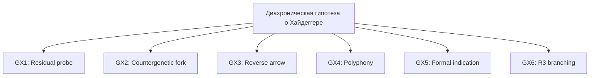

## Machenschaft, Technik, Gestell, Bestand

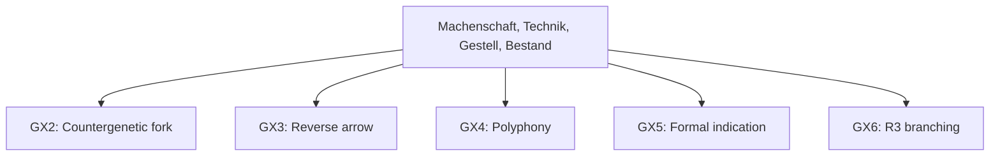

## Source-forced constellation: Geviert / Göttliche / Erde / Himmel / Sterbliche / Ding

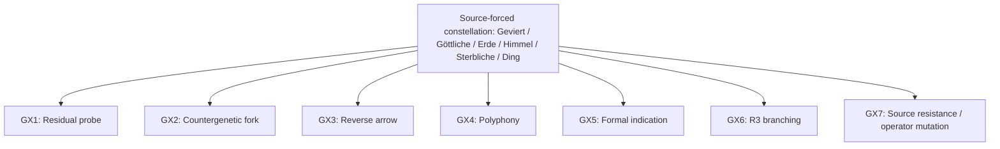

## GEVIERT_RELATA_FIRST_REJECTION

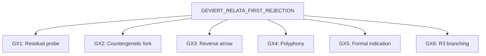

## CO_CONSTITUTIVE_HYPOTHESIS

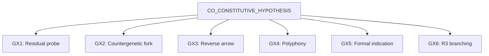

## RELATION_FIRST_STRONG

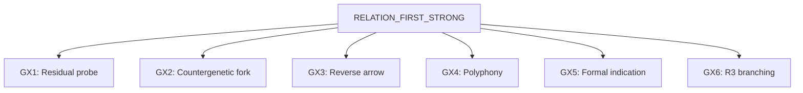

## DING_WORLD

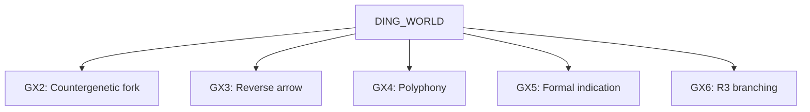

## NEARNESS_DIFFERENCE

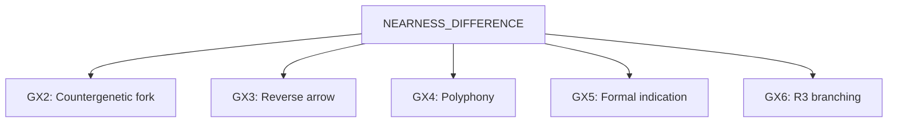

## PLACE_SPACE_REVERSAL

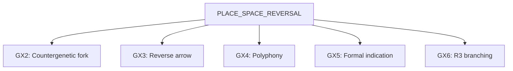

## GOD_TRANSLATION_FIREWALL

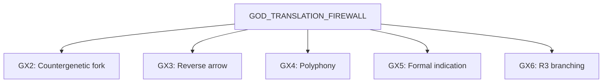

## UNIVERSAL_ONTOLOGY

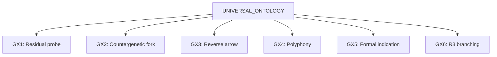

## METHOD_MUTATION

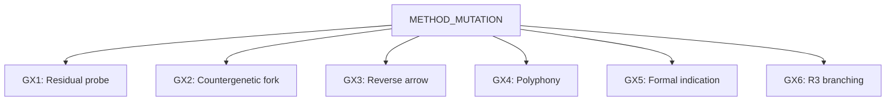

## Межконстелляционные ветви

- `N-DIACHRONIC_HEIDEGGER-GX6-R3_G_BRANCH` → `N-EMERGENT_CLAIM_DING_WORLD-HYPOTHESIS_SEED-QUESTION`: A branch crosses constellations through F-LANGUAGE-TRANSLATION without subsuming the second question.
- `N-EMERGENT_CLAIM_CO_CONSTITUTIVE_HYPOTHESIS-GX6-R3_G_BRANCH` → `N-EMERGENT_CLAIM_DING_WORLD-HYPOTHESIS_SEED-QUESTION`: A branch crosses constellations through F-LANGUAGE-TRANSLATION, F-RELATION-GENESIS, F-REPRESENTATION-RESISTANCE without subsuming the second question.
- `N-EMERGENT_CLAIM_RELATION_FIRST_STRONG-GX6-R3_G_BRANCH` → `N-EMERGENT_CLAIM_DING_WORLD-HYPOTHESIS_SEED-QUESTION`: A branch crosses constellations through F-RELATION-GENESIS, F-LANGUAGE-TRANSLATION, F-REPRESENTATION-RESISTANCE without subsuming the second question.
- `N-EMERGENT_CLAIM_GEVIERT_RELATA_FIRST_REJECTION-GX6-R3_G_BRANCH` → `N-EMERGENT_CLAIM_CO_CONSTITUTIVE_HYPOTHESIS-HYPOTHESIS_SEED-QUESTION`: A branch crosses constellations through F-RELATION-GENESIS, F-LANGUAGE-TRANSLATION, F-REPRESENTATION-RESISTANCE without subsuming the second question.
- `N-EMERGENT_CLAIM_CO_CONSTITUTIVE_HYPOTHESIS-GX6-R3_G_BRANCH` → `N-EMERGENT_CLAIM_NEARNESS_DIFFERENCE-HYPOTHESIS_SEED-QUESTION`: A branch crosses constellations through F-LANGUAGE-TRANSLATION, F-REPRESENTATION-RESISTANCE without subsuming the second question.
- `N-EMERGENT_SOURCE_GEVIERT-GX6-R3_G_BRANCH` → `N-EMERGENT_CLAIM_DING_WORLD-HYPOTHESIS_SEED-QUESTION`: A branch crosses constellations through F-RELATION-GENESIS, F-REPRESENTATION-RESISTANCE, F-LANGUAGE-TRANSLATION, F-WORLD-ACCESS without subsuming the second question.
- `N-DIACHRONIC_HEIDEGGER-GX6-R3_G_BRANCH` → `N-EMERGENT_SOURCE_GEVIERT-HYPOTHESIS_SEED-QUESTION`: A branch crosses constellations through F-LANGUAGE-TRANSLATION without subsuming the second question.
- `N-EMERGENT_CLAIM_PLACE_SPACE_REVERSAL-GX6-R3_G_BRANCH` → `N-EMERGENT_CLAIM_METHOD_MUTATION-HYPOTHESIS_SEED-QUESTION`: A branch crosses constellations through F-LANGUAGE-TRANSLATION, F-REPRESENTATION-RESISTANCE without subsuming the second question.
- `N-EMERGENT_CLAIM_NEARNESS_DIFFERENCE-GX6-R3_G_BRANCH` → `N-EMERGENT_CLAIM_METHOD_MUTATION-HYPOTHESIS_SEED-QUESTION`: A branch crosses constellations through F-LANGUAGE-TRANSLATION, F-REPRESENTATION-RESISTANCE without subsuming the second question.
- `N-EMERGENT_SOURCE_GEVIERT-GX6-R3_G_BRANCH` → `N-EMERGENT_CLAIM_METHOD_MUTATION-HYPOTHESIS_SEED-QUESTION`: A branch crosses constellations through F-RELATION-GENESIS, F-REPRESENTATION-RESISTANCE, F-LANGUAGE-TRANSLATION without subsuming the second question.
- `N-EMERGENT_CLAIM_PLACE_SPACE_REVERSAL-GX6-R3_G_BRANCH` → `N-EMERGENT_CLAIM_GOD_TRANSLATION_FIREWALL-HYPOTHESIS_SEED-QUESTION`: A branch crosses constellations through F-LANGUAGE-TRANSLATION, F-REPRESENTATION-RESISTANCE without subsuming the second question.
- `N-DIACHRONIC_HEIDEGGER-GX6-R3_G_BRANCH` → `N-EMERGENT_CLAIM_METHOD_MUTATION-HYPOTHESIS_SEED-QUESTION`: A branch crosses constellations through F-LANGUAGE-TRANSLATION without subsuming the second question.
- `N-EMERGENT_SOURCE_GEVIERT-GX6-R3_G_BRANCH` → `N-EMERGENT_CLAIM_GEVIERT_RELATA_FIRST_REJECTION-HYPOTHESIS_SEED-QUESTION`: A branch crosses constellations through F-RELATION-GENESIS, F-REPRESENTATION-RESISTANCE, F-LANGUAGE-TRANSLATION without subsuming the second question.
- `N-EMERGENT_CLAIM_CO_CONSTITUTIVE_HYPOTHESIS-GX6-R3_G_BRANCH` → `N-EMERGENT_CLAIM_RELATION_FIRST_STRONG-HYPOTHESIS_SEED-QUESTION`: A branch crosses constellations through F-LANGUAGE-TRANSLATION, F-RELATION-GENESIS, F-REPRESENTATION-RESISTANCE without subsuming the second question.
- `N-EMERGENT_CLAIM_RELATION_FIRST_STRONG-GX6-R3_G_BRANCH` → `N-EMERGENT_CLAIM_NEARNESS_DIFFERENCE-HYPOTHESIS_SEED-QUESTION`: A branch crosses constellations through F-LANGUAGE-TRANSLATION, F-REPRESENTATION-RESISTANCE without subsuming the second question.
- `N-EMERGENT_CLAIM_GOD_TRANSLATION_FIREWALL-GX6-R3_G_BRANCH` → `N-EMERGENT_CLAIM_UNIVERSAL_ONTOLOGY-HYPOTHESIS_SEED-QUESTION`: A branch crosses constellations through F-LANGUAGE-TRANSLATION, F-REPRESENTATION-RESISTANCE without subsuming the second question.
- `N-EMERGENT_CLAIM_DING_WORLD-GX6-R3_G_BRANCH` → `N-EMERGENT_CLAIM_METHOD_MUTATION-HYPOTHESIS_SEED-QUESTION`: A branch crosses constellations through F-LANGUAGE-TRANSLATION, F-RELATION-GENESIS, F-REPRESENTATION-RESISTANCE without subsuming the second question.
- `N-DIACHRONIC_HEIDEGGER-GX6-R3_G_BRANCH` → `N-EMERGENT_CLAIM_CO_CONSTITUTIVE_HYPOTHESIS-HYPOTHESIS_SEED-QUESTION`: A branch crosses constellations through F-LANGUAGE-TRANSLATION without subsuming the second question.
- `N-EMERGENT_CLAIM_NEARNESS_DIFFERENCE-GX6-R3_G_BRANCH` → `N-EMERGENT_CLAIM_PLACE_SPACE_REVERSAL-HYPOTHESIS_SEED-QUESTION`: A branch crosses constellations through F-LANGUAGE-TRANSLATION, F-REPRESENTATION-RESISTANCE without subsuming the second question.
- `N-EMERGENT_CLAIM_CO_CONSTITUTIVE_HYPOTHESIS-GX6-R3_G_BRANCH` → `N-EMERGENT_CLAIM_PLACE_SPACE_REVERSAL-HYPOTHESIS_SEED-QUESTION`: A branch crosses constellations through F-LANGUAGE-TRANSLATION, F-REPRESENTATION-RESISTANCE without subsuming the second question.
- `N-EMERGENT_CLAIM_RELATION_FIRST_STRONG-GX6-R3_G_BRANCH` → `N-EMERGENT_CLAIM_UNIVERSAL_ONTOLOGY-HYPOTHESIS_SEED-QUESTION`: A branch crosses constellations through F-RELATION-GENESIS, F-LANGUAGE-TRANSLATION, F-REPRESENTATION-RESISTANCE without subsuming the second question.
- `N-TECHNOLOGY_AND_ORDERING-GX6-R3_G_BRANCH` → `N-EMERGENT_CLAIM_UNIVERSAL_ONTOLOGY-HYPOTHESIS_SEED-QUESTION`: A branch crosses constellations through F-UNDERDETERMINATION without subsuming the second question.
- `N-EMERGENT_CLAIM_NEARNESS_DIFFERENCE-GX6-R3_G_BRANCH` → `N-EMERGENT_CLAIM_UNIVERSAL_ONTOLOGY-HYPOTHESIS_SEED-QUESTION`: A branch crosses constellations through F-LANGUAGE-TRANSLATION, F-REPRESENTATION-RESISTANCE without subsuming the second question.
- `N-EMERGENT_CLAIM_RELATION_FIRST_STRONG-GX6-R3_G_BRANCH` → `N-EMERGENT_CLAIM_METHOD_MUTATION-HYPOTHESIS_SEED-QUESTION`: A branch crosses constellations through F-RELATION-GENESIS, F-LANGUAGE-TRANSLATION, F-REPRESENTATION-RESISTANCE without subsuming the second question.
- `N-DIACHRONIC_HEIDEGGER-GX6-R3_G_BRANCH` → `N-EMERGENT_CLAIM_GEVIERT_RELATA_FIRST_REJECTION-HYPOTHESIS_SEED-QUESTION`: A branch crosses constellations through F-LANGUAGE-TRANSLATION without subsuming the second question.
- `N-EMERGENT_CLAIM_GEVIERT_RELATA_FIRST_REJECTION-GX6-R3_G_BRANCH` → `N-EMERGENT_CLAIM_METHOD_MUTATION-HYPOTHESIS_SEED-QUESTION`: A branch crosses constellations through F-RELATION-GENESIS, F-LANGUAGE-TRANSLATION, F-REPRESENTATION-RESISTANCE without subsuming the second question.
- `N-EMERGENT_CLAIM_CO_CONSTITUTIVE_HYPOTHESIS-GX6-R3_G_BRANCH` → `N-EMERGENT_CLAIM_UNIVERSAL_ONTOLOGY-HYPOTHESIS_SEED-QUESTION`: A branch crosses constellations through F-LANGUAGE-TRANSLATION, F-RELATION-GENESIS, F-REPRESENTATION-RESISTANCE without subsuming the second question.
- `N-EMERGENT_CLAIM_GEVIERT_RELATA_FIRST_REJECTION-GX6-R3_G_BRANCH` → `N-EMERGENT_CLAIM_PLACE_SPACE_REVERSAL-HYPOTHESIS_SEED-QUESTION`: A branch crosses constellations through F-LANGUAGE-TRANSLATION, F-REPRESENTATION-RESISTANCE without subsuming the second question.
- `N-EMERGENT_CLAIM_GOD_TRANSLATION_FIREWALL-GX6-R3_G_BRANCH` → `N-EMERGENT_CLAIM_METHOD_MUTATION-HYPOTHESIS_SEED-QUESTION`: A branch crosses constellations through F-LANGUAGE-TRANSLATION, F-REPRESENTATION-RESISTANCE without subsuming the second question.
- `N-EMERGENT_SOURCE_GEVIERT-GX6-R3_G_BRANCH` → `N-EMERGENT_CLAIM_RELATION_FIRST_STRONG-HYPOTHESIS_SEED-QUESTION`: A branch crosses constellations through F-RELATION-GENESIS, F-REPRESENTATION-RESISTANCE, F-LANGUAGE-TRANSLATION without subsuming the second question.
- `N-DIACHRONIC_HEIDEGGER-GX6-R3_G_BRANCH` → `N-EMERGENT_CLAIM_NEARNESS_DIFFERENCE-HYPOTHESIS_SEED-QUESTION`: A branch crosses constellations through F-LANGUAGE-TRANSLATION without subsuming the second question.
- `N-EMERGENT_CLAIM_GEVIERT_RELATA_FIRST_REJECTION-GX6-R3_G_BRANCH` → `N-EMERGENT_CLAIM_RELATION_FIRST_STRONG-HYPOTHESIS_SEED-QUESTION`: A branch crosses constellations through F-RELATION-GENESIS, F-LANGUAGE-TRANSLATION, F-REPRESENTATION-RESISTANCE without subsuming the second question.
- `N-DIACHRONIC_HEIDEGGER-GX6-R3_G_BRANCH` → `N-EMERGENT_CLAIM_RELATION_FIRST_STRONG-HYPOTHESIS_SEED-QUESTION`: A branch crosses constellations through F-LANGUAGE-TRANSLATION without subsuming the second question.
- `N-EMERGENT_SOURCE_GEVIERT-GX6-R3_G_BRANCH` → `N-EMERGENT_CLAIM_NEARNESS_DIFFERENCE-HYPOTHESIS_SEED-QUESTION`: A branch crosses constellations through F-REPRESENTATION-RESISTANCE, F-LANGUAGE-TRANSLATION without subsuming the second question.
- `N-EMERGENT_CLAIM_DING_WORLD-GX6-R3_G_BRANCH` → `N-EMERGENT_CLAIM_UNIVERSAL_ONTOLOGY-HYPOTHESIS_SEED-QUESTION`: A branch crosses constellations through F-LANGUAGE-TRANSLATION, F-RELATION-GENESIS, F-REPRESENTATION-RESISTANCE without subsuming the second question.
- `N-EMERGENT_CLAIM_UNIVERSAL_ONTOLOGY-GX6-R3_G_BRANCH` → `N-EMERGENT_CLAIM_METHOD_MUTATION-HYPOTHESIS_SEED-QUESTION`: A branch crosses constellations through F-LANGUAGE-TRANSLATION, F-RELATION-GENESIS, F-REPRESENTATION-RESISTANCE without subsuming the second question.
- `N-EMERGENT_CLAIM_GEVIERT_RELATA_FIRST_REJECTION-GX6-R3_G_BRANCH` → `N-EMERGENT_CLAIM_NEARNESS_DIFFERENCE-HYPOTHESIS_SEED-QUESTION`: A branch crosses constellations through F-LANGUAGE-TRANSLATION, F-REPRESENTATION-RESISTANCE without subsuming the second question.
- `N-EMERGENT_CLAIM_RELATION_FIRST_STRONG-GX6-R3_G_BRANCH` → `N-EMERGENT_CLAIM_PLACE_SPACE_REVERSAL-HYPOTHESIS_SEED-QUESTION`: A branch crosses constellations through F-LANGUAGE-TRANSLATION, F-REPRESENTATION-RESISTANCE without subsuming the second question.
- `N-TECHNOLOGY_AND_ORDERING-GX6-R3_G_BRANCH` → `N-EMERGENT_CLAIM_NEARNESS_DIFFERENCE-HYPOTHESIS_SEED-QUESTION`: A branch crosses constellations through F-ONTOLOGICAL-DIFFERENCE without subsuming the second question.
- `N-EMERGENT_CLAIM_RELATION_FIRST_STRONG-GX6-R3_G_BRANCH` → `N-EMERGENT_CLAIM_GOD_TRANSLATION_FIREWALL-HYPOTHESIS_SEED-QUESTION`: A branch crosses constellations through F-LANGUAGE-TRANSLATION, F-REPRESENTATION-RESISTANCE without subsuming the second question.
- `N-EMERGENT_CLAIM_GEVIERT_RELATA_FIRST_REJECTION-GX6-R3_G_BRANCH` → `N-EMERGENT_CLAIM_DING_WORLD-HYPOTHESIS_SEED-QUESTION`: A branch crosses constellations through F-RELATION-GENESIS, F-LANGUAGE-TRANSLATION, F-REPRESENTATION-RESISTANCE without subsuming the second question.
- `N-EMERGENT_CLAIM_PLACE_SPACE_REVERSAL-GX6-R3_G_BRANCH` → `N-EMERGENT_CLAIM_UNIVERSAL_ONTOLOGY-HYPOTHESIS_SEED-QUESTION`: A branch crosses constellations through F-LANGUAGE-TRANSLATION, F-REPRESENTATION-RESISTANCE without subsuming the second question.
- `N-EMERGENT_SOURCE_GEVIERT-GX6-R3_G_BRANCH` → `N-EMERGENT_CLAIM_GOD_TRANSLATION_FIREWALL-HYPOTHESIS_SEED-QUESTION`: A branch crosses constellations through F-REPRESENTATION-RESISTANCE, F-LANGUAGE-TRANSLATION without subsuming the second question.
- `N-EMERGENT_SOURCE_GEVIERT-GX6-R3_G_BRANCH` → `N-EMERGENT_CLAIM_PLACE_SPACE_REVERSAL-HYPOTHESIS_SEED-QUESTION`: A branch crosses constellations through F-REPRESENTATION-RESISTANCE, F-LANGUAGE-TRANSLATION without subsuming the second question.
- `N-EMERGENT_CLAIM_DING_WORLD-GX6-R3_G_BRANCH` → `N-EMERGENT_CLAIM_GOD_TRANSLATION_FIREWALL-HYPOTHESIS_SEED-QUESTION`: A branch crosses constellations through F-LANGUAGE-TRANSLATION, F-REPRESENTATION-RESISTANCE without subsuming the second question.
- `N-EMERGENT_SOURCE_GEVIERT-GX6-R3_G_BRANCH` → `N-EMERGENT_CLAIM_UNIVERSAL_ONTOLOGY-HYPOTHESIS_SEED-QUESTION`: A branch crosses constellations through F-RELATION-GENESIS, F-REPRESENTATION-RESISTANCE, F-LANGUAGE-TRANSLATION without subsuming the second question.
- `N-EMERGENT_SOURCE_GEVIERT-GX6-R3_G_BRANCH` → `N-EMERGENT_CLAIM_CO_CONSTITUTIVE_HYPOTHESIS-HYPOTHESIS_SEED-QUESTION`: A branch crosses constellations through F-RELATION-GENESIS, F-REPRESENTATION-RESISTANCE, F-LANGUAGE-TRANSLATION without subsuming the second question.
- `N-EMERGENT_CLAIM_DING_WORLD-GX6-R3_G_BRANCH` → `N-EMERGENT_CLAIM_PLACE_SPACE_REVERSAL-HYPOTHESIS_SEED-QUESTION`: A branch crosses constellations through F-LANGUAGE-TRANSLATION, F-REPRESENTATION-RESISTANCE without subsuming the second question.
- `N-EMERGENT_CLAIM_NEARNESS_DIFFERENCE-GX6-R3_G_BRANCH` → `N-EMERGENT_CLAIM_GOD_TRANSLATION_FIREWALL-HYPOTHESIS_SEED-QUESTION`: A branch crosses constellations through F-LANGUAGE-TRANSLATION, F-REPRESENTATION-RESISTANCE without subsuming the second question.
- `N-EMERGENT_CLAIM_GEVIERT_RELATA_FIRST_REJECTION-GX6-R3_G_BRANCH` → `N-EMERGENT_CLAIM_GOD_TRANSLATION_FIREWALL-HYPOTHESIS_SEED-QUESTION`: A branch crosses constellations through F-LANGUAGE-TRANSLATION, F-REPRESENTATION-RESISTANCE without subsuming the second question.
- `N-EMERGENT_CLAIM_DING_WORLD-GX6-R3_G_BRANCH` → `N-EMERGENT_CLAIM_NEARNESS_DIFFERENCE-HYPOTHESIS_SEED-QUESTION`: A branch crosses constellations through F-LANGUAGE-TRANSLATION, F-REPRESENTATION-RESISTANCE without subsuming the second question.
- `N-EMERGENT_CLAIM_CO_CONSTITUTIVE_HYPOTHESIS-GX6-R3_G_BRANCH` → `N-EMERGENT_CLAIM_METHOD_MUTATION-HYPOTHESIS_SEED-QUESTION`: A branch crosses constellations through F-LANGUAGE-TRANSLATION, F-RELATION-GENESIS, F-REPRESENTATION-RESISTANCE without subsuming the second question.
- `N-DIACHRONIC_HEIDEGGER-GX6-R3_G_BRANCH` → `N-EMERGENT_CLAIM_PLACE_SPACE_REVERSAL-HYPOTHESIS_SEED-QUESTION`: A branch crosses constellations through F-LANGUAGE-TRANSLATION without subsuming the second question.
- `N-DIACHRONIC_HEIDEGGER-GX6-R3_G_BRANCH` → `N-EMERGENT_CLAIM_UNIVERSAL_ONTOLOGY-HYPOTHESIS_SEED-QUESTION`: A branch crosses constellations through F-LANGUAGE-TRANSLATION without subsuming the second question.
- `N-EMERGENT_CLAIM_CO_CONSTITUTIVE_HYPOTHESIS-GX6-R3_G_BRANCH` → `N-EMERGENT_CLAIM_GOD_TRANSLATION_FIREWALL-HYPOTHESIS_SEED-QUESTION`: A branch crosses constellations through F-LANGUAGE-TRANSLATION, F-REPRESENTATION-RESISTANCE without subsuming the second question.
- `N-EMERGENT_CLAIM_GEVIERT_RELATA_FIRST_REJECTION-GX6-R3_G_BRANCH` → `N-EMERGENT_CLAIM_UNIVERSAL_ONTOLOGY-HYPOTHESIS_SEED-QUESTION`: A branch crosses constellations through F-RELATION-GENESIS, F-LANGUAGE-TRANSLATION, F-REPRESENTATION-RESISTANCE without subsuming the second question.
- `N-DIACHRONIC_HEIDEGGER-GX6-R3_G_BRANCH` → `N-EMERGENT_CLAIM_GOD_TRANSLATION_FIREWALL-HYPOTHESIS_SEED-QUESTION`: A branch crosses constellations through F-LANGUAGE-TRANSLATION without subsuming the second question.

