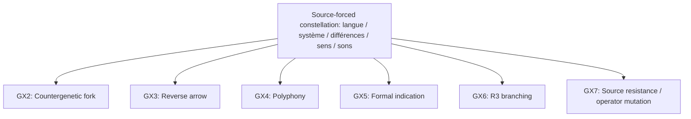
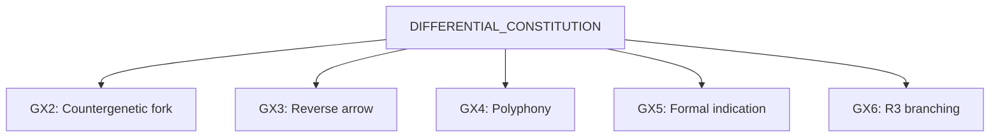
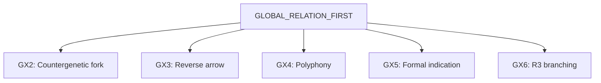

# Карта генеративных констелляций

GX — независимые жесты overlay, а не стадии конвейера.

## Source-forced constellation: langue / système / différences / sens / sons

## DIFFERENTIAL_CONSTITUTION

## GLOBAL_RELATION_FIRST

## Межконстелляционные ветви

- `N-EMERGENT_SOURCE_LANGUE-GX6-R3_G_BRANCH` → `N-EMERGENT_CLAIM_GLOBAL_RELATION_FIRST-HYPOTHESIS_SEED-QUESTION`: A branch crosses constellations through F-REPRESENTATION-RESISTANCE, F-LANGUAGE-TRANSLATION without subsuming the second question.
- `N-EMERGENT_CLAIM_DIFFERENTIAL_CONSTITUTION-GX6-R3_G_BRANCH` → `N-EMERGENT_CLAIM_GLOBAL_RELATION_FIRST-HYPOTHESIS_SEED-QUESTION`: A branch crosses constellations through F-LANGUAGE-TRANSLATION, F-REPRESENTATION-RESISTANCE without subsuming the second question.
- `N-EMERGENT_SOURCE_LANGUE-GX6-R3_G_BRANCH` → `N-EMERGENT_CLAIM_DIFFERENTIAL_CONSTITUTION-HYPOTHESIS_SEED-QUESTION`: A branch crosses constellations through F-REPRESENTATION-RESISTANCE, F-LANGUAGE-TRANSLATION without subsuming the second question.

