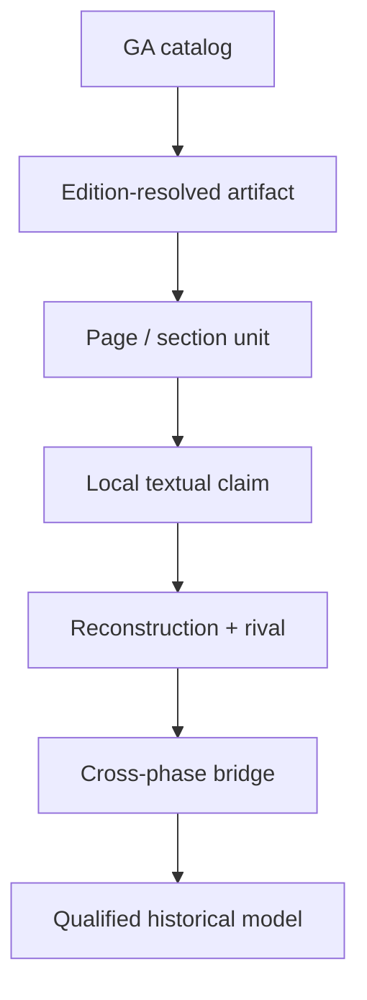

# Пилот Destruktion Automation Engine на Heidegger Gesamtausgabe

Дата: 11 августа 2026 года  
Версия движка: 0.2.1-alpha.1  
Тестовый узел: GA 1, `Das Realitätsproblem in der modernen Philosophie`, p. 1

## Продолжение в 0.2.2

Первый одно-страничный probe расширен до всей работы 1912 года по оригинальной журнальной публикации, с. 353–363 / GA 1, с. 1–15. Новый page-aware intake проверяет source fixity, access policy и печатные локаторы, не удерживая полный текст. Результат: 11 страниц, 280 units, 24 review records, pro/con graph `CONTESTED`; ограниченная критико-реалистическая реконструкция проходит claim discipline, а повышение до фундаментальной онтологии остаётся `SUSPEND`. Полный разбор: `full-work-1912/FULL_WORK_REPORT.md`.

## Итог

Проект прошёл локальный тест, но не получил права на корпусный или сильный диахронический вывод.

- библиографический слой GA собран воспроизводимо: 105 записей до GA 105 в четырёх разделах;
- локальное утверждение GA 1, p. 1 прошло claim-discipline;
- немецкий analyzer после исправления обнаружил один кандидат RT04 и не повысил его выше `STRUCTURAL_ONLY`;
- жанровый вес каталога оставлен на human review;
- переход GA 1 → GA 2 и перевод `das Reale` приостановлены;
- план корпусной проверки заморожен, но исполнение заблокировано DATA/AUTH/LIC/CODER.

Это правильный результат. Каталожная полнота не была выдана за полноту текста, а локальная формула — за доказательство всей траектории Хайдеггера.

## 1. Аудит входного источника

Страница beyng.com полезна как вторичный навигационный и цифровой access index. Библиографической опорой выбран актуальный Editionsplan издательства Vittorio Klostermann. На дату snapshot он содержит 105 отдельных записей и четыре раздела:

1. опубликованные сочинения 1910–1976;
2. лекции 1919–1944;
3. неопубликованные трактаты, доклады и продуманное;
4. указания и записи.

Порядок GA не является чистой хронологией мышления. Поэтому корпус должен иметь одновременно три координаты: `GA volume`, дата создания/чтения и дата/редакция публикации. Иначе поздно опубликованная рукопись будет ошибочно прочитана как поздний текст.

## 2. Первый реальный прогон: GA 1, p. 1

### P−1: сцена до кода

Исходная сцена — спор о том, является ли реальность внешнего мира вообще философской проблемой. Апелляции к здравому смыслу противопоставляется различение практической, наивной установки и методически направленного определения реального.

### Локальная реконструкция

| Элемент | Содержание |
|---|---|
| A | Внешняя реальность принимается как самоочевидная и не нуждающаяся в вопросе |
| P | Наивная практическая установка отделяется от научно-методического определения реального |
| B | Освобождение от мнимой самоочевидности открывает проблему для более глубокого исследования |
| Автоматический кандидат | `RT04`, необходимое условие |
| Масштаб | одна локальная формула на одной странице раннего текста |

RT04 относится только к сформулированной в пассаже предпосылке более глубокого осознания задачи. Он не доказывает, что раннее `Realitätsproblem` логически, генетически или телеологически производит фундаментальную онтологию `Sein und Zeit`.

### Что обнаружил тест

До исправления analyzer выделил шесть текстовых единиц и ноль отношений: русско-английский lexical adapter был слеп к немецкому оригиналу. После добавления немецких сигналов тот же источник дал один RT04-candidate, `0 ERROR`, два review flags и запрет semantic promotion.

Это полезный failure-driven результат: немецкая поддержка возникла не из декларации, а из воспроизведённого провала.

## 3. Протокольные исходы

| Run | Исход | Смысл |
|---|---|---|
| Локальный тезис GA 1, p. 1 | `PASS` | происхождение, режим, масштаб и revision trigger заданы |
| Аудит каталога | `REVIEW` | источник разведен, но жанровый вес не подписан человеком |
| Сильная линия GA 1 → GA 2 | `SUSPEND` | нет typed bridge, rival и K/ΔO |
| `das Reale` → русский паспорт | `SUSPEND` | нет трёх сопоставимых переводов, примера и контрпримера |
| Корпусный план | `FROZEN_BUT_BLOCKED` | нет воспроизводимого корпуса, лицензии и независимых кодировщиков |

## 4. Что проект предотвратил

1. Издательское описание ранних проблем не стало доказательством авторской непрерывности.
2. Поздняя терминология `Dasein`, `Vorhandenheit`, `Seinsfrage` не была ретроецирована в ранний текст.
3. `das Reale` не было автоматически отождествлено с `Wirklichkeit`, «действительным», «сущим» или поздним онтологическим словарём.
4. Одна страница не была превращена в характеристику GA 1 целиком.
5. Наличие 105 каталожных записей не было выдано за наличие законного полнотекстового корпуса.

## 5. Обнаруженные ограничения

| Ограничение | Статус |
|---|---|
| Немецкие lexical relations отсутствовали | исправлено и покрыто regression test |
| URL/HTML intake остаётся ручным диагностическим адаптером | требует отдельного безопасного ingest layer |
| HTML headings, body, сноски и обрыв страницы пока дают грубую paragraph unitization | требуется GA-aware structural parser |
| Связь цифровой страницы с конкретной печатной редакцией не удостоверена | edition reconciliation pending |
| Полный немецкий корпус не лицензирован и не snapshot-ирован | execution blocked |
| Нет независимых немецкоязычных кодировщиков | reliability не установлена |

## 6. Правильная архитектура GA-исследования

Переход через слой недопустим без собственного evidence contract. Особенно опасен прыжок `catalog → historical model` и переход `lexical continuity → ontological continuity`.

## 7. Следующая последовательность

1. Полностью разобрать первое сочинение GA 1 с edition-resolved страницами: тезисы, проблемы, отношения, rivals и остатки.
2. Сопоставить проблемы категории, значения, времени и истории с GA 56/57–63 без предположения непрерывности.
3. Отдельно исследовать GA 2 и GA 24: опубликованный проект и второй заход `Zeit und Sein`.
4. Только затем строить мост к GA 65–73, проверяя разрыв `Sein/Seyn`, Ereignis и позднюю самореконструкцию.
5. Параллельно вести немецко-русские паспорта терминов, не смешивая перевод с доказательством.

## Вердикт

DAE пригоден для локализованного аудита GA уже сейчас: он различает источник, метаданные, локальный тезис, реконструкцию и сильное повышение. Он пока не является автоматическим интерпретатором всей Gesamtausgabe. Самое важное — инструмент корректно остановил именно те выводы, которые на первом фрагменте выглядели бы интеллектуально эффектно, но доказательно были бы пустыми.

## Продолжение в 0.2.3

Пользовательское 697-страничное DOCX-досье прогнано как отдельный composite corpus. Прогон выявил ASCII-boundary дефект русского lexical layer, после исправления дал 840 review candidates и подтвердил необходимость жёсткого genre/provenance firewall: досье сохранено как hypothesis/stress-test bank, но source, D2.8 и anti-self-circulation gates блокируют его использование как первичного или независимого свидетельства. Подробности находятся в `user-dossier-ga1-1-2026/DOSSIER_RUN_REPORT.md`.
