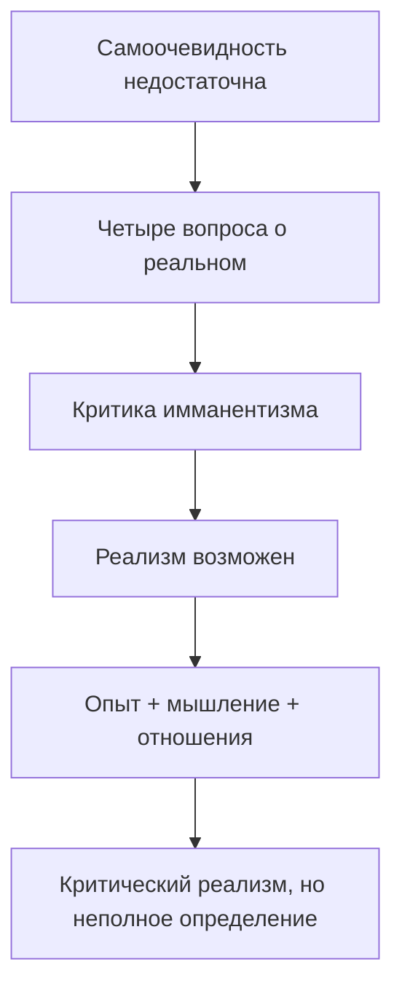

# GA 1: полный пилот первой работы

Дата snapshot: 11 августа 2026 года  
Версия движка: 0.2.2-alpha.1  
Текст: Martin Heidegger, *Das Realitätsproblem in der modernen Philosophie* (1912)  
Первичный локатор: *Philosophisches Jahrbuch* 25, с. 353–363  
Сверка с GA: GA 1, с. 1–15, точная постраничная карта подтверждена лишь частично

## Итог

Вся первая работа GA 1 разобрана как единый аргументативный объект. Наиболее защищаемый результат таков: текст не просто утверждает существование внешнего мира, а строит программу критического реализма через различение полагания и определения реального, критику сведения знания к фактам сознания и совместную работу опыта с мышлением. При этом собственная природа реального остаётся идеальной, не полностью достижимой целью определения.

Сильная версия — будто здесь уже осуществлена фундаментальная онтология `Sein und Zeit` — не проходит. Статья работает в субъект-объектной эпистемологической рамке, ориентируется на естествознание, логическую идеальность и Кюльпе; аналитики Dasein, In-der-Welt-sein и Zeitlichkeit здесь нет. Лексическая встречаемость существительного `Sein` не закрывает этот разрыв.

Итог аргументного графа — `CONTESTED`, а не `SUPPORTED`: критико-реалистическая реконструкция объясняет композицию статьи, но кантианский, структурно-реалистический и антикруговой rivals остаются действующими.

## 1. Источник и границы допустимого вывода

Аналитическим источником стала не поздняя HTML-копия GA, а [оригинальная журнальная публикация 1912 года](https://philosophisches-jahrbuch.de/wp-content/uploads/2018/10/PJ25_S353-363_Heidegger_Das-Realit%C3%A4tsproblem-in-der-modernen-Philosophie.pdf), размещённая в [архиве журнала](https://philosophisches-jahrbuch.de/archiv). PDF содержит 11 печатных страниц, 353–363. [Официальная карточка GA 1](https://www.klostermann.de/epages/63574303.sf/de_DE/?ObjectPath=%2FShops%2F63574303%2FProducts%2F9783465000341) удостоверяет том и редакцию, а навигационная карта GA задаёт границу репринта на с. 1–15.

Сверка имеет статус `PAGE_LEVEL_PARTIAL`: начало совпадает с GA 1, с. 1, а граница работы установлена как GA 1, с. 1–15; точное соответствие каждого абзаца журнальной и GA-пагинации не предполагается. Поэтому все содержательные ссылки в этом этапе ведут на первичную журнальную пагинацию.

Полный текст не включён в проект. Инструмент временно извлекает его, проверяет два SHA-256, строит производные селекторы и удаляет сырой PDF и текст. В релизе остаются только хеши, страницы, позиции, короткие сигналы, статистика и самостоятельная парафраза.

## 2. Машинный прогон

| Показатель | Результат |
|---|---:|
| Печатные страницы | 11 |
| Позиционные единицы | 280 |
| Единицы с RT-кандидатами | 24 |
| Неоднозначные модальные единицы | 17 |
| Conformant records | 24/24 |
| Ошибки | 0 |
| Review flags | 65 |
| Покрытие печатным локатором | 100% |
| Сырой текст в output | нет |

Выбранные отношения: `RT00 × 17`, `RT01 × 3`, `RT04 × 1`, `RT08 × 1`, `RT14 × 1`, `RT19 × 1`.

Единственный устойчивый прямой кандидат — `RT04` по формуле `notwendige Vorbedingung` на с. 353. Семнадцать форм `muss/müssen/soll/sollte` не получили RT21: голый модальный глагол может выражать норму, логическую необходимость, методическое требование или пересказ ожидания. Движок создаёт rivals RT04/RT21 и оставляет итог `RT00`.

Это исправляет воспроизведённую категориальную ошибку предыдущего адаптера, который мог счесть немецкую аргументативную необходимость нормативным обязательством. Также удалён слабый автоматический переход от метафорического `beherrscht` к RT25.

## 3. Карта текста по первичной пагинации

| Страница | Функция в аргументе |
|---|---|
| 353 | Постановка проблемы: здравый смысл отделён от методического определения; снятие мнимой самоочевидности задано как условие исследования; начинается историческая рамка |
| 354 | Berkeley, Hume, Kant и послекантовская линия используются для генеалогии кризиса реализма |
| 355 | Конфликт философского имманентизма/феноменализма с реалистической практикой естествознания; ввод программы Кюльпе |
| 356 | Четыре вопроса: допустимость и способ полагания, допустимость и способ определения; обзор солипсизма, имманентной философии, эмпириокритицизма и монизма ощущений |
| 357 | Критика принципа имманентности; первое, априорное, возражение разбирается через различение акта, содержания и предмета |
| 358 | Эмпирическое и методологическое возражения: факты сознания сами не образуют знание; логические принципы не сводятся к психической причинности |
| 359 | Переход к феноменализму: он допускает полагание неизвестного X, но запрещает содержательное определение; критика субъективности форм у Канта |
| 360 | Самостоятельность мышления и его предметная направленность; отрицательная часть завершает лишь доказательство возможности реализма |
| 361 | Положительная часть: независимая регулярность и сообщаемость опыта; одновременно отвергается наивное тождество восприятия и реальности |
| 362 | Опыт и мышление действуют совместно; причинное объяснение не определяет качество причины; реальные носители реконструируются через доступные отношения |
| 363 | Адекватное определение остаётся идеальной целью; анти-сенсуализм и научно-практический мотив; итоговая поддержка Кюльпе с оговорками и призыв к схоластической работе |

## 4. Аргументативная архитектура

Главный методический плюс текста — он сам различает отрицательную и положительную задачи. Опровержение консциенциализма показывает лишь возможность реализма; оно не доказывает существование и природу независимых объектов. Положительный участок должен отдельно объяснить, как реальности полагаются и определяются.

### A: исходная сцена

Наивная установка принимает внешний мир одним жестом и потому не замечает проблемы. Методическая установка различает непосредственную практическую достаточность и научное определение. Это не скептическое отрицание мира, а требование сделать основание реалистической практики эксплицитным.

### P1: антипсихологистический мост

Ключевой ход — не смешивать:

| Уровень | Функция |
|---|---|
| Психический акт | Событие мышления в потоке сознания |
| Идеальное содержание | Повторимо и не тождественно конкретному акту |
| Интендированный предмет | То, о чём мыслится; его реальность не производится самим актом |

Этот мост разрушает простой довод: «если независимое от сознания мыслится, оно тем самым становится зависимым от сознания». Но он ещё не доказывает, что интендированный предмет существует реально; он блокирует только вывод от мыслимости к психической имманентности.

### P2: опыт и логическая идеальность

Чистая сумма содержаний сознания не даёт знания без принципов связи. Текст вводит объективные идеальные логические принципы, тем самым расширяя онтологический инвентарь сверх психических фактов. Однако здесь возникает собственная нагрузка доказательства: идеальная значимость логики не равна реальному существованию внешних объектов. Между двумя уровнями нужен самостоятельный bridge.

### P3: отношения, принудительность и коммуникация

Положительный аргумент опирается на три признака:

1. отношения в опыте не подчиняются индивидуальной воле;
2. один предмет доступен разным индивидам;
3. научная практика устойчиво описывает и предсказывает эти отношения.

Из этого предлагается полагать транссубъективные носители. Но переход остаётся абдуктивным. Независимость от воли слабее независимости от всякого субъекта; межсубъектная сообщаемость может уже предполагать общий мир; устойчивые отношения не однозначно определяют природу relata.

### B: положительная реконструкция

Реальность не совпадает с чувственным содержанием. Субъективные модификации должны устраняться сравнением опыта и рациональной обработки; реальные носители определяются через способности поддерживать установленные отношения. Адекватная спецификация остаётся идеальной целью. Поэтому итог статьи точнее называть фаллибилистским критическим реализмом, а не завершённой метафизикой.

## 5. Минимальное положительное ядро K

1. Исследование начинается с дестабилизации принятой самоочевидности.
2. Акт, идеальное содержание и предмет нельзя отождествлять.
3. Чувственное содержание не исчерпывает реальность.
4. Опыт и мышление совместно ограничивают допустимое определение.
5. Научное знание может продвигаться, не достигая окончательной адекватности.

Это ядро переносимо в последующий анализ только как набор проблем и различений. Оно не задаёт необходимого исторического развития.

## 6. Различающий остаток ΔO относительно GA 2

| В статье 1912 года | Вопрос, который ещё нельзя приписать тексту |
|---|---|
| Субъект, объект и транссубъективное | Dasein как In-der-Welt-sein |
| Полагание и определение реальностей | Смысл бытия вообще |
| Естествознание как главный explanandum | Экзистенциальная аналитика и мирность мира |
| Идеальные логические принципы | Временность как горизонт понимания бытия |
| Кюльпе, Гейзер, Мессер, схоластика | Деструкция истории онтологии в проекте 1927 года |

Автоматический индекс насчитал `BEING_NOUN = 11`, но `DASEIN = 0` и `TEMPORALITY = 0`. Это лишь лексическая диагностика. Нулевой счётчик не доказывает концептуального отсутствия, а наличие `Sein` не доказывает тождества вопроса о бытии.

## 7. Сильнейшие rivals

### Кантианский rival

Объективность, необходимость и общезначимость можно объяснить трансцендентальными условиями опыта, не превращая их в знание вещи самой по себе. Статья критикует такую позицию, но её представление Канта слишком быстрое, чтобы считать rival устранённым.

### Структурный rival

Можно принять реальные или объективно устойчивые отношения, научную предсказуемость и межсубъектную проверку, оставаясь агностиком относительно внутренней природы носителей. Это особенно сильно против финального перехода от relations к substances/powers.

### Rival кругового обоснования

Аргумент от общей сообщаемости уже использует множество субъектов и общий предметный мир. Если именно ими затем доказывается транссубъективность, возникает риск предположить результат.

### Прагматический rival

Успех естествознания поддерживает плодотворность реалистического языка, но сам по себе не гарантирует истинность его метафизического чтения. Текст одновременно использует научный успех и пренебрежительно оценивает прагматизм; напряжение не разрешено.

## 8. Что подтверждает и оспаривает исследовательская литература

[Kisiel и Sheehan, *Becoming Heidegger*](https://www.newyearbook-phenomenology.com/published-volumes.html) также выделяют три возражения против консциенциализма и считают смешение психического акта с идеальным содержанием их общей ошибкой. Это поддерживает нашу реконструкцию P1.

[Jeffrey Barash](https://www.fordhampress.com/9780823292158/martin-heidegger-and-the-problem-of-historical-meaning/) подчёркивает сильную зависимость статьи от Кюльпе и роль успеха естествознания в критике имманентизма. Это поддерживает жанровое понижение: текст нельзя читать как полностью автономную систему Хайдеггера.

[Anna Jani](https://real.mtak.hu/72999/) помещает раннюю постановку в контекст схоластики и дискуссии реалистической феноменологии. Это работает как rival против редукции статьи к простому реферату Кюльпе: выбор и присвоение программы имеют собственную историческую функцию.

[Trish Glazebrook](https://link.springer.com/article/10.1023/A%3A1013148922905) называет позицию 1912 года наивным реализмом и прослеживает более сложное позднее соединение реалистических и антиреалистических предпосылок. Даже если принять её линию, она показывает трансформацию, а не логически необходимую непрерывность.

Литература тем самым не даёт одного готового verdict. Она формирует минимум три конкурирующие модели: ранний наивный реализм, критически присвоенная программа Кюльпе и исходная точка последующей трансформации. Проект сохраняет их одновременно.

## 9. Что автоматизация действительно смогла и чего не смогла

Автоматизировано:

- проверка PDF и извлечения по SHA-256;
- page break как первичный milestone, по модели TEI `<pb>`;
- позиционные цели, вдохновлённые W3C Web Annotation;
- запрет анализа для `REFERENCE_ONLY` и запрет удержания текста для `DERIVATIVE_ONLY`;
- постраничные term/discourse индексы;
- маршрутизация сильных и неоднозначных RT-сигналов;
- протокольные исходы и аргументный граф с pro/con.

Не автоматизировано:

- семантическое распознавание неявного перехода от отношений к носителям;
- исторически справедливая реконструкция Berkeley, Hume и Kant;
- оценка независимости evidence и circularity;
- точная постраничная сверка журнальной публикации с GA 1;
- precision/recall без независимого gold и немецкоязычных кодировщиков.

Особенно важный отрицательный результат: центральная архитектура статьи в основном имеет тип RT15/RT16 — evidential support и reason-giving, — но лексический слой почти не обнаруживает её. Поэтому 24 кандидата нельзя считать «24 найденными аргументами». Это только очередь на чтение.

## 10. Протокольные исходы

| Проверка | Исход | Причина |
|---|---|---|
| Source audit всей работы | `REVIEW` | фиксация полная, но жанровый вес не аттестован независимым исследователем |
| Ограниченная реконструкция | `PASS` | происхождение, режим, масштаб и revision trigger заданы |
| «Уже фундаментальная онтология» | `SUSPEND` | нет target-mode, ontological dependency profile и моста access → existence |
| Однотекстовый анализ → benchmark | `SUSPEND` | нет явной лицензии на корпусное распространение и независимых кодировщиков |
| Абляция | `SUSPEND` | собственный baseline есть, внешнего сильного анализатора на gold-наборе нет |
| Аргументный граф | `CONTESTED` | применимы и pro-, и con-аргументы |

## Вердикт этапа

Проект теперь способен автоматически и безопасно разобрать полную страницу-за-страницей работу, сохранив доказательные границы. Философский результат не сводится к словарю: статья формирует критико-реалистическую программу, однако её решающий положительный bridge остаётся недоопределённым. Ранний текст предоставляет проблемное ядро для последующего исследования, но не лицензию на рассказ о неизбежном движении к `Sein und Zeit`.

Следующий обоснованный шаг — `Neuere Forschungen über Logik` (GA 1, с. 17–43): проверить, стабилизируется ли различение акта, идеального содержания и предмета во второй работе 1912 года. Только после этого допустим мост к диссертации 1913/1914 года; переход к GA 56/57 или GA 2 пока преждевременен.

## Методические модели

- [W3C Web Annotation Data Model](https://www.w3.org/TR/annotation-model/)
- [TEI P5 `<pb>`](https://www.tei-c.org/release/doc/tei-p5-doc/en/html/ref-pb.html)
- [IIIF Presentation API 3.0](https://iiif.io/api/presentation/3.0/)
