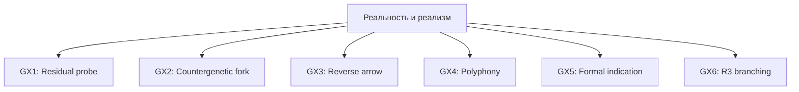
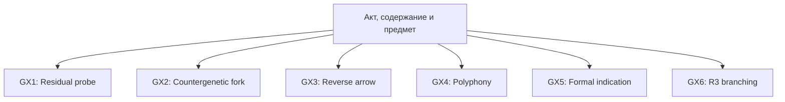
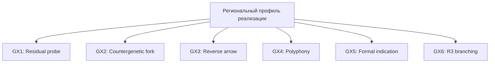
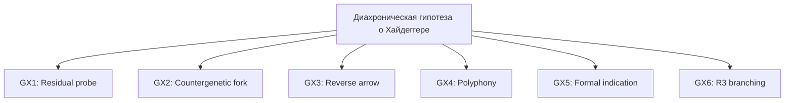
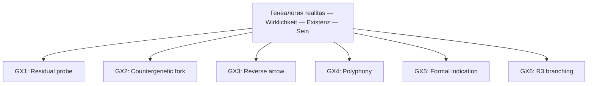
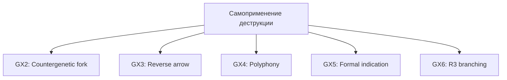
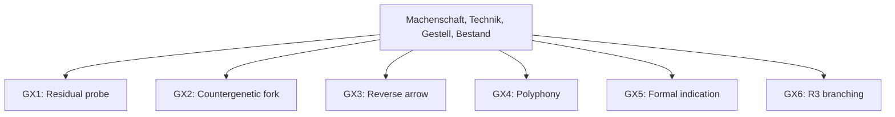
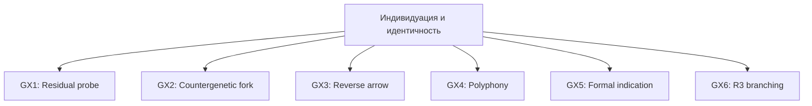

# Карта генеративных констелляций

GX — независимые жесты overlay, а не стадии конвейера.

## Реальность и реализм

## Акт, содержание и предмет

## Региональный профиль реализации

## Диахроническая гипотеза о Хайдеггере

## Генеалогия realitas — Wirklichkeit — Existenz — Sein

## Самоприменение деструкции

## Machenschaft, Technik, Gestell, Bestand

## Индивидуация и идентичность

## Межконстелляционные ветви

- `N-ACT_CONTENT_OBJECT-GX6-R3_G_BRANCH` → `N-REGIONAL_REALIZATION_PROFILE-HYPOTHESIS_SEED-QUESTION`: A branch crosses constellations through F-GIVENNESS-REFLECTION without subsuming the second question.
- `N-REGIONAL_REALIZATION_PROFILE-GX6-R3_G_BRANCH` → `N-TECHNOLOGY_AND_ORDERING-HYPOTHESIS_SEED-QUESTION`: A branch crosses constellations through F-UNDERDETERMINATION without subsuming the second question.
- `N-ACT_CONTENT_OBJECT-GX6-R3_G_BRANCH` → `N-TECHNOLOGY_AND_ORDERING-HYPOTHESIS_SEED-QUESTION`: A branch crosses constellations through F-VERIFICATION, F-ONTOLOGICAL-DIFFERENCE without subsuming the second question.
- `N-REALITY_AND_REALISM-GX6-R3_G_BRANCH` → `N-TECHNOLOGY_AND_ORDERING-HYPOTHESIS_SEED-QUESTION`: A branch crosses constellations through F-UNDERDETERMINATION, F-ONTOLOGICAL-DIFFERENCE without subsuming the second question.
- `N-REGIONAL_REALIZATION_PROFILE-GX6-R3_G_BRANCH` → `N-IDENTITY_AND_INDIVIDUATION-HYPOTHESIS_SEED-QUESTION`: A branch crosses constellations through F-ENABLEMENT, F-INDIVIDUATION, F-IDENTITY without subsuming the second question.
- `N-REALITY_AND_REALISM-GX6-R3_G_BRANCH` → `N-TERM_GENEALOGY-HYPOTHESIS_SEED-QUESTION`: A branch crosses constellations through F-REALITY-PROFILES, F-BEING-ROLES, F-LANGUAGE-TRANSLATION without subsuming the second question.
- `N-REALITY_AND_REALISM-GX6-R3_G_BRANCH` → `N-ACT_CONTENT_OBJECT-HYPOTHESIS_SEED-QUESTION`: A branch crosses constellations through F-ONTOLOGICAL-DIFFERENCE without subsuming the second question.
- `N-REALITY_AND_REALISM-GX6-R3_G_BRANCH` → `N-DIACHRONIC_HEIDEGGER-HYPOTHESIS_SEED-QUESTION`: A branch crosses constellations through F-REALITY-PROFILES, F-LANGUAGE-TRANSLATION without subsuming the second question.
- `N-DIACHRONIC_HEIDEGGER-GX6-R3_G_BRANCH` → `N-META_CRITIQUE-HYPOTHESIS_SEED-QUESTION`: A branch crosses constellations through F-MEDIATION-COMPRESSION without subsuming the second question.
- `N-REALITY_AND_REALISM-GX6-R3_G_BRANCH` → `N-REGIONAL_REALIZATION_PROFILE-HYPOTHESIS_SEED-QUESTION`: A branch crosses constellations through F-REALITY-PROFILES, F-UNDERDETERMINATION without subsuming the second question.
- `N-REGIONAL_REALIZATION_PROFILE-GX6-R3_G_BRANCH` → `N-TERM_GENEALOGY-HYPOTHESIS_SEED-QUESTION`: A branch crosses constellations through F-REALITY-PROFILES without subsuming the second question.
- `N-REGIONAL_REALIZATION_PROFILE-GX6-R3_G_BRANCH` → `N-DIACHRONIC_HEIDEGGER-HYPOTHESIS_SEED-QUESTION`: A branch crosses constellations through F-REALITY-PROFILES without subsuming the second question.
- `N-ACT_CONTENT_OBJECT-GX6-R3_G_BRANCH` → `N-IDENTITY_AND_INDIVIDUATION-HYPOTHESIS_SEED-QUESTION`: A branch crosses constellations through F-CONSTITUTION without subsuming the second question.
- `N-REALITY_AND_REALISM-GX6-R3_G_BRANCH` → `N-META_CRITIQUE-HYPOTHESIS_SEED-QUESTION`: A branch crosses constellations through F-UNDERDETERMINATION without subsuming the second question.
- `N-ACT_CONTENT_OBJECT-GX6-R3_G_BRANCH` → `N-META_CRITIQUE-HYPOTHESIS_SEED-QUESTION`: A branch crosses constellations through F-VERIFICATION without subsuming the second question.
- `N-META_CRITIQUE-GX6-R3_G_BRANCH` → `N-TECHNOLOGY_AND_ORDERING-HYPOTHESIS_SEED-QUESTION`: A branch crosses constellations through F-UNDERDETERMINATION, F-VERIFICATION without subsuming the second question.
- `N-REGIONAL_REALIZATION_PROFILE-GX6-R3_G_BRANCH` → `N-META_CRITIQUE-HYPOTHESIS_SEED-QUESTION`: A branch crosses constellations through F-UNDERDETERMINATION without subsuming the second question.
- `N-DIACHRONIC_HEIDEGGER-GX6-R3_G_BRANCH` → `N-TERM_GENEALOGY-HYPOTHESIS_SEED-QUESTION`: A branch crosses constellations through F-LANGUAGE-TRANSLATION, F-MEDIATION-COMPRESSION, F-REALITY-PROFILES without subsuming the second question.
- `N-TERM_GENEALOGY-GX6-R3_G_BRANCH` → `N-META_CRITIQUE-HYPOTHESIS_SEED-QUESTION`: A branch crosses constellations through F-MEDIATION-COMPRESSION without subsuming the second question.

