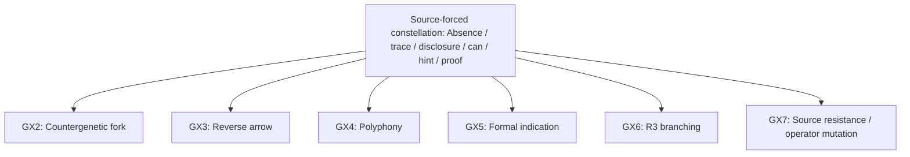

# Карта генеративных констелляций

GX — независимые жесты overlay, а не стадии конвейера.

## Source-forced constellation: Absence / trace / disclosure / can / hint / proof

## Межконстелляционные ветви

В этом проходе ветви не пересеклись.

